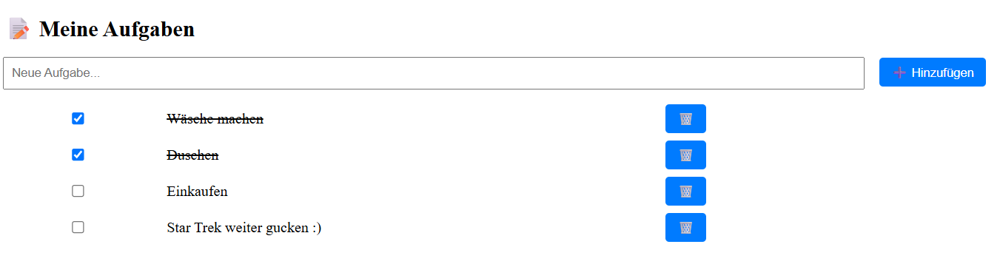

# 📝 Angular ToDo App

Ein kleines Übungsprojekt im Rahmen meiner Angular-Weiterentwicklung.  
Ziel: Wiederholung von Angular-Grundlagen wie Komponenten, Services, Datenbindung und `localStorage`.

---

## 🚀 Features
- Aufgaben hinzufügen
- Aufgaben als erledigt markieren
- Aufgaben löschen
- Speicherung im Browser über `localStorage`

---

## 🛠️ Tech Stack
- Angular 19 (Standalone Components)
- TypeScript
- LocalStorage API
- CSS

---

## 📦 Projekt starten (lokal)

```bash
git clone https://github.com/MarcelBerlin/angular-todo-app.git
cd angular-todo-app
npm install
ng serve


## 📸 Vorschau 
